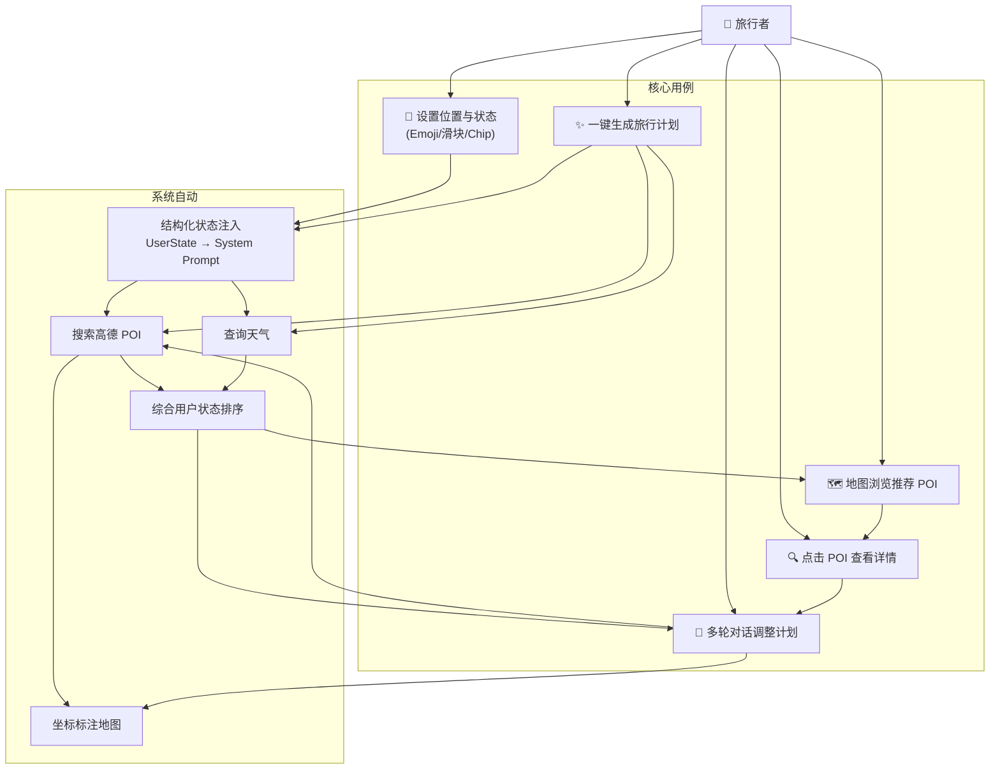
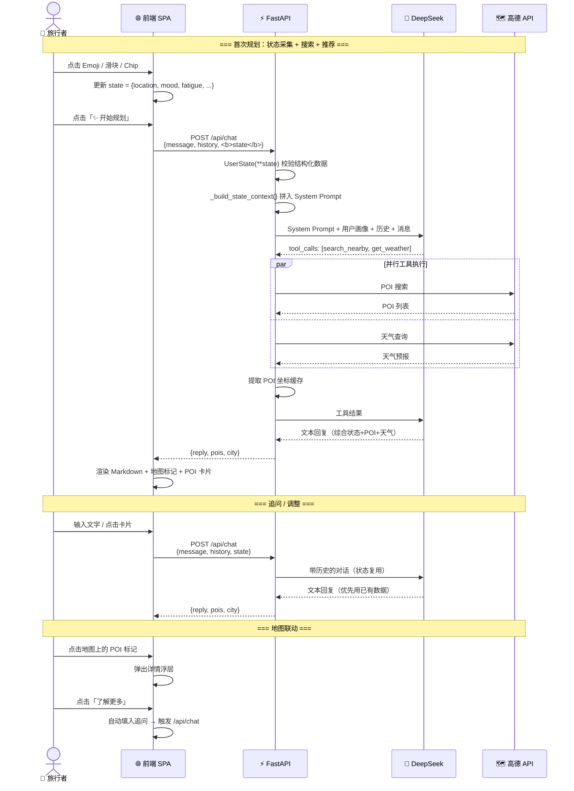
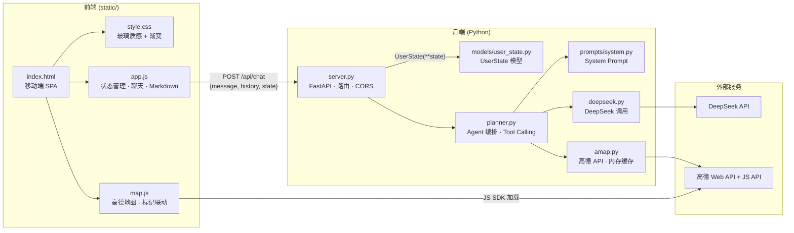
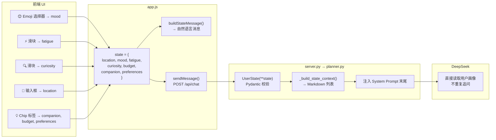
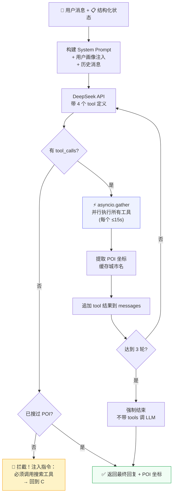

# 🧳 小旅 — 旅行智能体

> 移动端优先的 AI 旅行规划助手。用户通过情绪化 UI 输入状态，结构化传给后端，Agent 自动搜索高德 POI 并生成个性化推荐，地图与对话双向联动。

---

## 一、用例图



---

## 二、数据流图



---

## 三、系统架构（含数据流向）



---

## 四、UserState 结构化状态流



System Prompt 末尾注入示例：

```markdown
## 当前用户画像（来自UI输入，直接使用不要追问）
- 📍 位置：杭州西湖区
- 😊 心情：7/10
- ⚡ 疲惫度：3/10
- 🔍 好奇心：8/10
- 👥 同行者：独自
- 💡 偏好：自然风光、安静文艺、避开人多
- 💰 预算：100-300
```

---

## 五、Agent 决策循环



关键设计：
| 机制 | 说明 |
|------|------|
| 并行工具执行 | `asyncio.gather` 同时跑 POI搜索 + 天气查询 |
| 强制搜索拦截 | 第一轮 LLM 若凭知识直答，系统注入指令强制调工具 |
| 3 轮上限 | 防止无限循环，第 3 轮后不带 tools 强制输出 |
| 坐标捕获 | 工具执行时同步提取经纬度，前端地图直接使用 |
| 15s 工具超时 | 单工具超时自动跳过，不阻塞整体 |
| 状态注入 | UserState 结构化嵌入 System Prompt，LLM 不重复追问 |

---

## 六、项目结构

```
travel_agent/
│
├── server.py                  ← FastAPI 入口（路由 + 静态文件）
├── config.py                  ← 从 ../../.env 加载 API Key
├── requirements.txt           ← Python 依赖
├── README.md                  ← 本文档
│
├── models/
│   └── user_state.py          ← UserState 模型（Pydantic，1-10 量表）
│
├── services/                   ← 核心业务层
│   ├── planner.py             ← Agent 编排引擎（Tool Calling · 并行 · 拦截）
│   ├── deepseek.py            ← DeepSeek API 封装（OpenAI 兼容，30s 超时）
│   └── amap.py                ← 高德 API 封装（POI/天气/地理编码 + 5min 缓存）
│
├── prompts/
│   └── system.py              ← System Prompt（角色 · 三步法 · 输出格式）
│
└── static/                     ← 前端（移动端优先 SPA）
    ├── index.html              ← 单页应用入口
    ├── css/style.css           ← 渐变氛围 + 玻璃质感 + Markdown 样式
    ├── js/app.js               ← 主逻辑（状态管理 · 聊天 · Markdown 渲染）
    └── js/map.js               ← 高德地图模块（标记 · 联动 · 详情浮层）
```

| 文件 | 职责 | 关键函数 |
|------|------|----------|
| `server.py` | HTTP 入口，CORS，接收 state，转换 UserState | `POST /api/chat`, `GET /api/config` |
| `planner.py` | Agent 循环，并行工具执行，强制搜索拦截 | `run_agent()`, `execute_tool()`, `_build_state_context()` |
| `deepseek.py` | 调用 DeepSeek，支持 Function Calling | `chat(messages, tools)` |
| `amap.py` | 高德 API + 5 分钟内存缓存 | `search_pois()`, `text_search()`, `get_weather()` |
| `system.py` | Agent 角色定义、三步法、输出格式规范 | `SYSTEM_PROMPT` |
| `user_state.py` | 用户画像 Pydantic 模型，7 个维度 | `UserState.is_ready()`, `UserState.summary()` |
| `app.js` | 状态管理、Emoji/滑块/Chip 交互、结构化发送 | `sendMessage()`, `renderMarkdown()`, `buildStateMessage()` |
| `map.js` | 动态加载 JS SDK、标记管理、地图-对话联动 | `init()`, `setPOIMarkers()`, `flyTo()`, `geocode()` |

---

## 七、工具清单

Agent 可调用的 4 个高德工具：

| 工具 | 功能 | 参数 |
|------|------|------|
| `search_nearby` | 周边 POI 搜索 | keywords, city, location, radius |
| `search_citywide` | 全市 POI 搜索 | keywords, city |
| `get_weather` | 4 天天气预报 | city |
| `geocode` | 地址 → 经纬度 | address, city |

---

## 八、配置

在项目根目录 `d:\GIS_AI_Scripts\.env`：

```env
AMAP_KEY=你的高德Web服务Key
DEEPSEEK_API_KEY=你的DeepSeek Key
```

高德 Key 需开通：
- **Web服务 API** — 后端 POI 搜索、天气、地理编码
- **Web端 JS API** — 前端地图显示

---

## 九、启动

```bash
cd d:\GIS_AI_Scripts
.venv/Scripts/python -m uvicorn travel_agent.server:app --host 0.0.0.0 --port 7878
```

浏览器打开 `http://localhost:7878`
